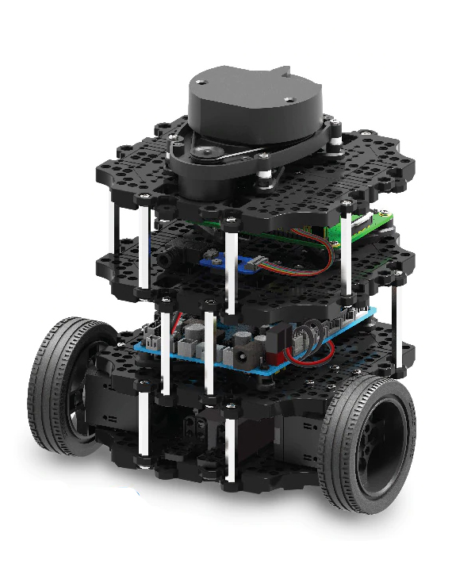
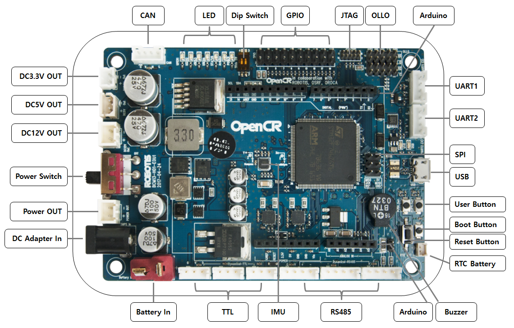
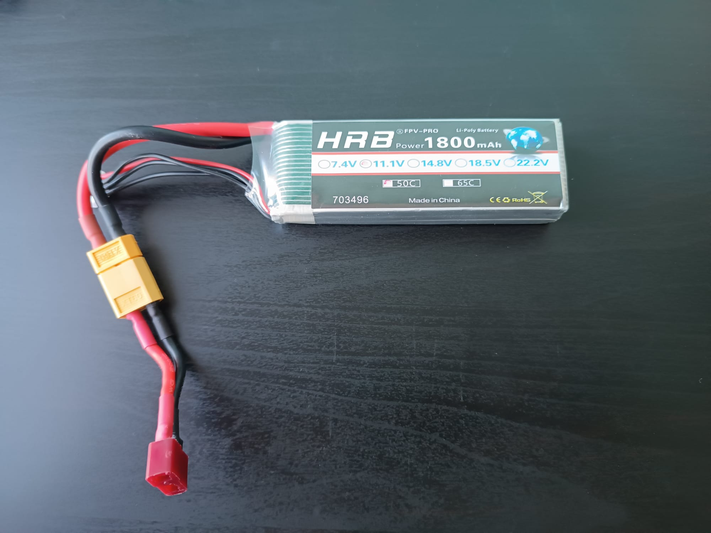

# TurtleBot3-NoROS-Library
Librería en Python diseñada para facilitar el control del robot TurtleBot 3 Burger sin necesidad de utilizar ROS. Con TurtleBot3-NoROS-Library, podrás acceder a las funciones de bajo nivel del robot de manera directa y sencilla, sin enfrentar la curva de aprendizaje de ROS. Además, la librería está diseñada para ser compatible tanto con el robot físico como con el simulador Webots, permitiendo a los usuarios utilizar el mismo código en ambos entornos. Este proyecto también incluye ejemplos y guías para ayudarte a empezar rápidamente, ya sea en simulación o en el mundo real.

# Guía de Uso de TurtleBot3-NoROS-Library

## Componentes del Robot

### Raspberry Pi 3
El cerebro del Turtlebot3, responsable de procesar la información y ejecutar los algoritmos de control.

.png)

### Servomotores Dynamixel XL430-W250
Motores de alta precisión que controlan el movimiento del robot.

### LiDAR LDS-01
Sensor que mide distancias y detecta obstáculos en 360° mediante láser.

#### Placa USB2LDS
Interfaz que conecta el LiDAR con la Raspberry Pi.

### Placa OpenCR 1.0
Controlador central que gestiona la comunicación entre los componentes del robot y la Raspberry Pi.

#### IMU (Unidad de Medición Inercial)
Proporciona datos de orientación y aceleración, esenciales para la navegación del robot.

### Batería
Batería de 11.1V y 1800mAh que proporciona energía a todos los componentes, con una autonomía de aproximadamente 2 horas y 30 minutos.

## Preparación del Robot

### Utilizar el Programa Precargado (ROS)
El robot viene con un programa en la placa OpenCR 1.0 para su uso con ROS. Si deseas trabajar con ROS, no es necesario cambiar este programa. (Adjuntar código).

### Cargar el Programa para la Librería Python

Para usar la librería Python, sigue estos pasos:

1. **Configurar Arduino IDE:**
   - Abre Arduino IDE y ve a `File -> Preferences -> Additional Boards Manager URLs`.
   - Añade la siguiente URL: `https://raw.githubusercontent.com/ROBOTIS-GIT/OpenCR/master/arduino/opencr_release/package_opencr_index.json`.
   - Instala la librería **Dynamixel2Arduino** desde el Library Manager.

2. **Conectar OpenCR 1.0 al Ordenador:**
   - Conecta la placa OpenCR 1.0 al ordenador mediante USB.

3. **Cargar el Programa:**
   - Asegúrate de que la placa OpenCR 1.0 esté seleccionada en Arduino IDE.
   - Carga el programa correcto para usar la librería Python. (Adjuntar código).

### Conectarse a la Raspberry Pi 3

Con el programa cargado en la placa OpenCR 1.0, conecta y configura la Raspberry Pi 3 del Turtlebot para cargar los archivos de la librería.