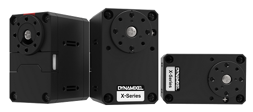

# TurtleBot3-NoROS-Library
Librería en Python diseñada para facilitar el control del robot TurtleBot 3 Burger sin necesidad de utilizar ROS. Con TurtleBot3-NoROS-Library, podrás acceder a las funciones de bajo nivel del robot de manera directa y sencilla, sin enfrentar la curva de aprendizaje de ROS. Además, la librería está diseñada para ser compatible tanto con el robot físico como con el simulador Webots, permitiendo a los usuarios utilizar el mismo código en ambos entornos. Este proyecto también incluye ejemplos y guías para ayudarte a empezar rápidamente, ya sea en simulación o en el mundo real.

# Guía de Uso de TurtleBot3-NoROS-Library


## Componentes del Robot

### Raspberry Pi 3
El cerebro del Turtlebot3, responsable de procesar la información y ejecutar los algoritmos de control.

.png)

### Servomotores Dynamixel XL430-W250
Motores de alta precisión que controlan el movimiento del robot.



### LiDAR LDS-01
Sensor que mide distancias y detecta obstáculos en 360° mediante láser.


#### Placa USB2LDS
Interfaz que conecta el LiDAR con la Raspberry Pi.


### Placa OpenCR 1.0
Controlador central que gestiona la comunicación entre los componentes del robot y la Raspberry Pi.


#### IMU (Unidad de Medición Inercial)
Proporciona datos de orientación y aceleración, esenciales para la navegación del robot.

### Batería
Batería de 11.1V y 1800mAh que proporciona energía a todos los componentes, con una autonomía de aproximadamente 2 horas y 30 minutos.


## Preparación del Robot

### Utilizar el Programa Precargado (ROS)
El robot viene con un programa en la placa OpenCR 1.0 para su uso con ROS. Si deseas trabajar con ROS, no es necesario cambiar este firmware.
En caso de cambiar el firmware de la placa y querer volver a utilizarlo para ROS, seguir los pasos que se muestran en el siguiente enlace:
[Instrucciones para utilizar la openCR 1.0 con ROS](https://emanual.robotis.com/docs/en/platform/turtlebot3/opencr_setup/#opencr-setup)

### Cargar el Programa para la Librería Python

Para usar la librería Python, sigue estos pasos:

1. **Configurar Arduino IDE:**
   - Abre Arduino IDE y ve a `File -> Preferences -> Additional Boards Manager URLs`.
   - Añade la siguiente URL: `https://raw.githubusercontent.com/ROBOTIS-GIT/OpenCR/master/arduino/opencr_release/package_opencr_index.json`.
   - Instala la librería **Dynamixel2Arduino** desde el Library Manager.

 

2. **Conectar OpenCR 1.0 al Ordenador:**
   - Conecta la placa OpenCR 1.0 al ordenador mediante USB.

3. **Cargar el Programa:**
   - Asegúrate de que la placa OpenCR 1.0 esté seleccionada en Arduino IDE.
   - Carga el programa correcto para usar la librería Python. (Adjuntar código).

### Conectarse a la Raspberry Pi 3

Con el programa cargado en la placa OpenCR 1.0, conecta y configura la Raspberry Pi 3 del Turtlebot para cargar los archivos de la librería.

1. **Conexión SSH:**
   - Conecta la Raspberry Pi 3 a la misma red que tu ordenador.
   - Utiliza un cliente SSH (como PuTTY) para conectarte a la Raspberry Pi 3.

2. **Clonar el Repositorio:**
   - Clona el repositorio de la librería en la Raspberry Pi 3:
     ```
     git clone git@github.com:jpperezm/TurtleBot3-NoROS-Library.git
       ```

4. **Ejecutar programa de prueba:**
   - Ejecuta el programa de prueba para comprobar que la librería funciona correctamente:
     ```
     python turtlebot_python_wrapper/test_code/odometry.py
     ```
Si todo está configurado correctamente, el robot debería moverse hacia adelante unos centimetros y parar.

## Uso de la Librería con Webots (Simulador)

### Cargar código del simulador a la Raspberry Pi 3

Para cargar el código del simulador en la Raspberry Pi 3 se debe crear un fichero .sh en ubuntu o .bat en windows con el siguiente contenido, sustituyendo los valores de las variables por los correspondientes a tu configuración:

**Ubuntu:**
```bash
#!/bin/bash

# Variables
TARGET="[nombre del fichero].py"
DESTINATION="ubuntu@[IP del turtlebot]:[ruta destino en el turtlebot]"
CODE_DIR="[ruta destino en el turtlebot]"
SSH_USER="ubuntu"
SSH_HOST="[IP del turtlebot]"

# Function to deploy the file
deploy() {
    scp "$TARGET" "$DESTINATION"
}

# Function to run the script on the robot
run() {
    scp "$TARGET" "$DESTINATION"
    ssh "$SSH_USER@$SSH_HOST" "cd $CODE_DIR && python3 $TARGET"
}

# Function to clean the target file on the robot
clean() {
    ssh "$SSH_USER@$SSH_HOST" "rm -f ${CODE_DIR}${TARGET}"
}

# Check the command line argument
if [ "$1" == "deploy" ]; then
    deploy
elif [ "$1" == "run" ]; then
    run
elif [ "$1" == "clean" ]; then
    clean
else
    echo "Usage: $0 {deploy|run|clean}"
    exit 1
fi
```

**Windows:**
```bash
@echo off

REM Variables
set TARGET="[nombre del fichero].py"
set DESTINATION="ubuntu@[IP del turtlebot]:[ruta destino en el turtlebot]"
set CODE_DIR="[ruta destino en el turtlebot]"
set SSH_USER="ubuntu"
set SSH_HOST="[IP del turtlebot]"

REM Function to deploy the file
:deploy
    scp %TARGET% %DESTINATION%
    goto :eof

REM Function to run the script on the robot
:run
    scp %TARGET% %DESTINATION%
    ssh %SSH_USER%@%SSH_HOST% "cd %CODE_DIR% && python3 %TARGET%"
    goto :eof

REM Function to clean the target file on the robot
:clean
    ssh %SSH_USER%@%SSH_HOST% "rm -f %CODE_DIR%%TARGET%"
    goto :eof

REM Check the command line argument
if "%1"=="deploy" goto deploy
if "%1"=="run" goto run
if "%1"=="clean" goto clean

REM Invalid argument
echo Usage: %~nx0 {deploy^|run^|clean}
exit /b 1
```

Este fichero se debe ejecutar con el siguiente comando en ubuntu:

```bash
./deploy.sh deploy
```

En windows se debe ejecutar con el siguiente comando:

```bash
deploy.bat deploy
```
También basta con hacer doble click en el fichero .bat.
